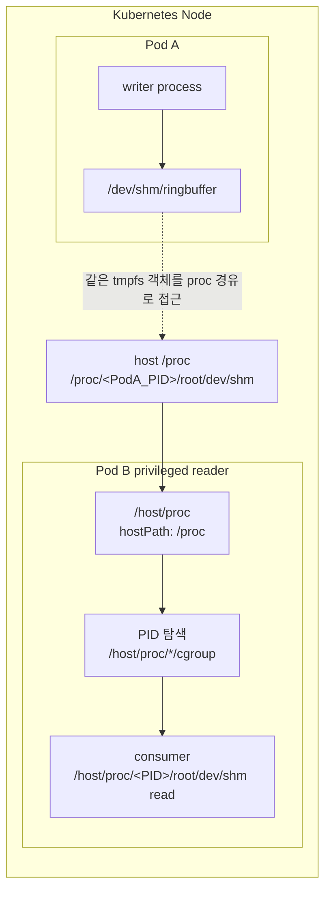
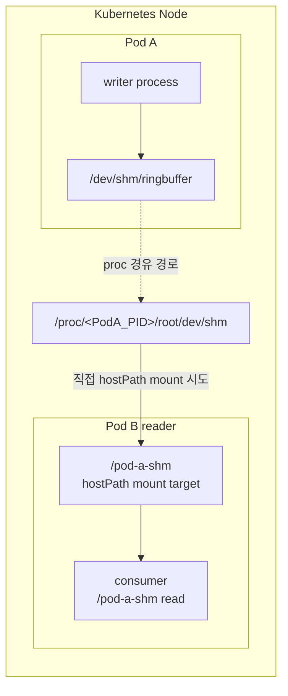
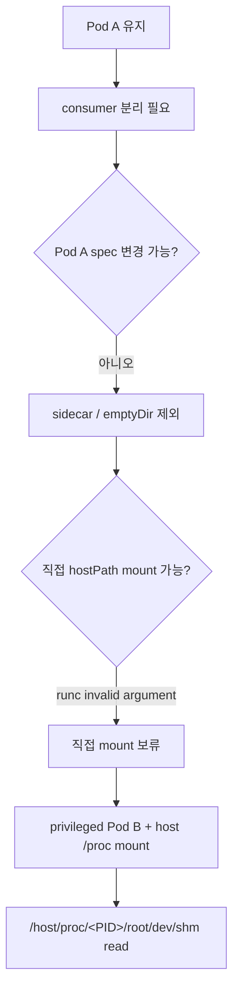

# Kubernetes Pod `/dev/shm` 접근 방식 정리

작성일: 2026-06-16

이 문서는 `docs/architecture/k8s-pod-shm-access-summary.html`의 Confluence 이관용 Markdown이다.

## 배경

기존 Pod A는 `/dev/shm`에 ringbuffer 데이터를 작성한다. 새 구조에서는 Pod A를 수정하지 않고, 별도 Pod B에서 해당 데이터를 읽어 consumer 역할을 수행하려고 한다.

주요 조건은 다음과 같다.

- Pod A는 그대로 유지한다.
- consumer가 Pod A 내부 리소스를 사용하지 않도록 별도 Pod로 분리한다.
- `/dev/shm`에 작성된 ringbuffer 데이터를 실시간에 가깝게 읽어야 한다.
- Pod A와 Pod B는 같은 Node에 있어야 한다.

## `/proc/&lt;PID&gt;/root/dev/shm` 접근 원리

Linux container는 별도의 머신이 아니라 host kernel 위에서 namespace와 cgroup으로 격리된 process다. Pod A 안의 container도 Node에서 보면 host PID를 가진 Linux process다.

host의 `/proc/&lt;PID&gt;/root`는 해당 process가 자신의 root filesystem으로 보는 경로를 가리킨다. 따라서 host에서 `/proc/&lt;PID&gt;/root/dev/shm`을 따라가면, 해당 container 내부의 `/dev/shm`으로 접근할 수 있다.

| 경로 | 의미 |
| --- | --- |
| `/proc` | host kernel이 제공하는 process 정보 파일시스템 |
| `/proc/&lt;PID&gt;` | host에서 본 특정 process의 상태, namespace, fd, mount 정보 |
| `/proc/&lt;PID&gt;/root` | 그 process가 container 내부에서 `/`로 보는 root filesystem |
| `/proc/&lt;PID&gt;/root/dev/shm` | 그 process가 container 내부에서 `/dev/shm`으로 보는 tmpfs/shared memory 경로 |

## 방식 1: privileged Pod B가 host `/proc`에서 동적 접근



### 동작 흐름

1. Pod B를 `privileged: true`, `hostPID: true`로 실행한다.
2. host `/proc`를 Pod B의 `/host/proc`로 read-only mount한다.
3. Pod B가 Kubernetes API 또는 `/host/proc/*/cgroup` 검색으로 Pod A container PID를 찾는다.
4. `/host/proc/&lt;PID&gt;/root/dev/shm/&lt;ringbuffer-file&gt;` 경로를 직접 읽는다.
5. 기존 consumer가 `/dev/shm/<file>` 경로만 읽는 경우 symlink를 검토한다.
6. Pod A 재시작 시 PID를 재탐색한다.

### 장점

- Pod A 수정이 필요 없다.
- Pod B가 PID를 다시 찾으면 Pod A 재시작에 대응할 수 있다.
- `/dev/shm`의 tmpfs 기반 접근 장점을 대부분 유지한다.
- 별도 network hop 없이 데이터를 읽을 수 있다.

### 단점

- `privileged`, `hostPID`, host `/proc` mount가 필요하므로 보안 리스크가 크다.
- Pod A와 Pod B가 같은 Node에 있어야 한다.
- PID 탐색과 재탐색 로직이 필요하다.

## 방식 2: `/proc/&lt;PID&gt;/root/dev/shm` 직접 hostPath mount



### 기대한 장점

- Pod B가 host `/proc` 전체를 볼 필요가 없다.
- Pod B를 privileged 없이 실행할 가능성이 있다.
- Pod B consumer는 `/pod-a-shm`만 읽으면 되므로 구현이 단순하다.

### 실제 검증 결과

직접 hostPath mount 테스트에서 container 생성 단계가 실패했다.

```text
Error: failed to create containerd task: failed to create shim task:
OCI runtime create failed: runc create failed:
error mounting "/proc/&lt;PID&gt;/root/dev/shm" to rootfs at "/dpp/shm":
mount /proc/&lt;PID&gt;/root/dev/shm:/dpp/shm (...), flags: 0x5001:
invalid argument
```

### 판단

`/proc/&lt;PID&gt;/root/dev/shm`는 일반적인 정적 host directory가 아니라 특정 process의 root와 mount namespace를 통해 해석되는 procfs 기반 경로다. 이 경로를 container runtime이 새 container rootfs 안으로 bind mount하는 과정에서 runc가 안정적으로 처리하지 못할 수 있다.

따라서 직접 hostPath mount 방식은 현재 환경에서 보류한다.

## 최종 추천

현재 조건에서는 방식 1을 채택한다.



## 보안 확인 항목

- Namespace Pod Security Admission 라벨 확인
- `privileged` 허용 여부 확인
- `hostPID` 허용 여부 확인
- hostPath `/proc` mount 허용 여부 확인
- Pod B에서 읽는 경로를 read-only로 제한
- PID 탐색 로직이 대상 Pod/Container 범위를 벗어나지 않도록 제한

