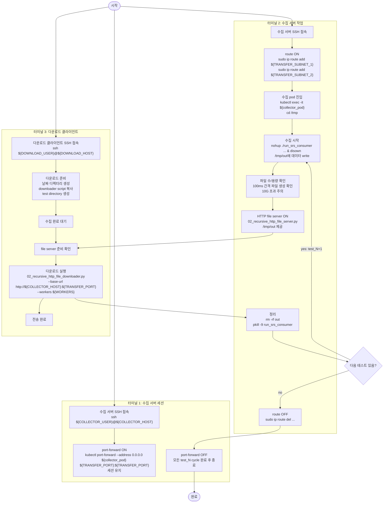
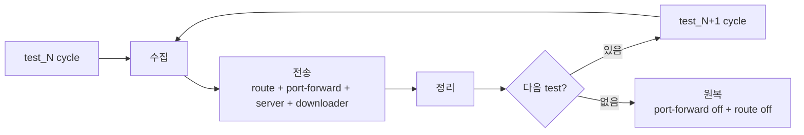

# 기존 데이터 수집 타임라인

작성일: 2026-06-16

원본: `docs/operations/exist_guild.sh`

이 문서는 기존에 사람이 터미널을 나눠 수행하던 수동 데이터 수집/전송 흐름을 Confluence 이관용 Markdown으로 정리한 것이다. 민감한 내부 값은 placeholder로 치환한다.

## 핵심 흐름

## 수동 절차를 웹앱 action으로 재구성

| 수동 터미널 기준 | 웹앱 action 기준 |
| --- | --- |
| 터미널 1 port-forward 유지 | 전송 준비 action의 하위 단계 |
| 터미널 2 route on/off | 전송 준비/원복 action의 하위 단계 |
| 터미널 2 수집 시작/중지 | 수집 action |
| 터미널 2 file server 실행 | 전송 action 내부 자동 실행 |
| 터미널 3 downloader 실행 | 전송 action 내부 자동 실행 |
| 터미널 2 정리 | 전송 성공 후 후처리 또는 사용자 선택 |

## 반복 cycle

## 구현 반영 포인트

- 웹 UI는 터미널 1/2/3을 그대로 노출하지 않고 수집/전송/정리/원복 action으로 제공한다.
- port-forward와 route는 전송 action의 앞단과 뒷단으로 묶는다.
- file server와 downloader는 순서가 있지만 같은 전송 흐름으로 본다.
- server/downloader 파일은 내부 위치에서 복사하지 않고 repo의 `scripts/transfer/`에서 대상 환경으로 배포하는 방향을 선호한다.
- 실제 내부망 파일은 개발 환경에 없을 수 있으므로 웹앱 시작 시 존재 여부를 체크한다.
